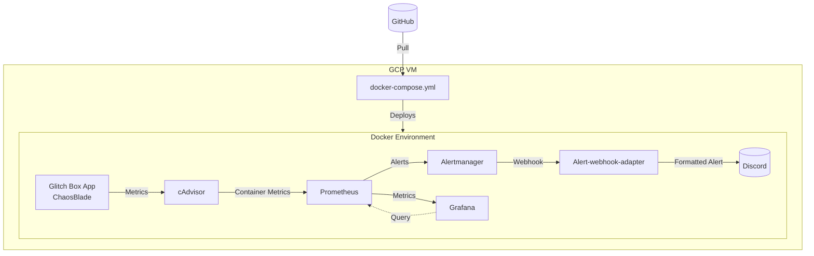

# Project Docker Containers and Monitoring - Internship Report

## 1. Introduction

### 1.1. Project Overview
<!-- Brief description of the project, objectives and importance -->
Docker Containers and Monitoring project is implemented to gain basic knowledge of Container monitoring and logging. This is part of DevOps internship program, focusing on deploying containerized web application (app-glitchbox) on Linux VM with monitoring and alerting.

### 1.2. Scope of Work
- **Timeline:** week 01 
- **Environment:** Production
- **Main Technologies:** Docker, Prometheus, Grafana, Alertmanager

### 1.3. Team Members
- **Intern:** Tai Le
- **Mentor:** Khoi Nguyen
- **Reviewer:** Khoi Nguyen

## 2. Requirements

### 2.1. Requirements Description

#### Primary Requirements:
<!-- Detailed description of the problem to be solved -->
- "Create git repository"
- "Create a Google Cloud account that includes a sub-account (IAM) with full permissions for Mentor"
- "Automatically deploy Glitch Box App, monitoring and alerting (grafana) to containers"
- "Automatically send alert to Discord"
  
### 2.2. Technical Requirements

#### Environment:
- **OS:** Ubuntu 22.04
- **Cloud Provider:** GCP
- **Containerization:** Docker
- **Monitoring:** Prometheus, Grafana, Alertmanager

## 3. Solution Architecture

### 3.1. Solution Overview
The system uses Prometheus, Alertmanager and Grafana to ensure Monitoring, Alerting and Visualization.

#### Architecture Diagram:
<!-- Use Mermaid diagrams for better visualization -->


### 3.2. Main Components

#### Monitoring & Alerting:
- **Monitoring:** Prometheus, Grafana
- **Alerting:** AlertManager

## 4. Implementation Guide

### 4.1. Related Files/Scripts

#### Repository Structure:
```
project-01/
├── glitchbox-app/           # App deployment
│   ├── Dockerfile
│   ├── docker-compose.yml
|   └── entrypoint.sh
├── monitoring/              # Monitoring tool deployment
│   ├── .env           
│   ├── alertmanager.yml
│   ├── alerts.yml
|   ├── docker-compose.yml
|   └── prometheus.yml
```

#### Key Files:
- **Dockerfile:** Install ChaosBlade app
- **glitchbox-app/docker-compose.yml:** Build Glitchbox App from Dockerfile with "healthcheck" enabled
- **monitoring/docker-compose.yml:** Build necessary tool from available images

### 4.2. Initial Setup

#### Prerequisites:
```bash
# Set up Docker's apt repository

# Add Docker's official GPG key:
sudo apt-get update
sudo apt-get install ca-certificates curl
sudo install -m 0755 -d /etc/apt/keyrings
sudo curl -fsSL https://download.docker.com/linux/ubuntu/gpg -o /etc/apt/keyrings/docker.asc
sudo chmod a+r /etc/apt/keyrings/docker.asc

# Add the repository to Apt sources:
echo \
  "deb [arch=$(dpkg --print-architecture) signed-by=/etc/apt/keyrings/docker.asc] https://download.docker.com/linux/ubuntu \
  $(. /etc/os-release && echo "${UBUNTU_CODENAME:-$VERSION_CODENAME}") stable" | \
  sudo tee /etc/apt/sources.list.d/docker.list > /dev/null
sudo apt-get update

#Install the Docker packages.
sudo apt-get install docker-ce docker-ce-cli containerd.io docker-buildx-plugin docker-compose-plugin
```

#### Configuration Steps:
1. **Clone repository:**
   ```bash
   #You will need to create a token on github and enter it in the password field when cloning the repository.
   git clone https://github.com/Qu11et/Yoong-DevOps-Project-01.git

   #save the token so you don't have to re-enter it every time you execute git command
   git config --global credential.helper cache
   
   cd Yoong-DevOps-Project-01/project-01
   ```

2. **Run docker compose**
   ```bash
   #Added user into docker group
   sudo usermod -aG docker $USER
   
   cd glitchbox-app
   docker compose build
   docker compose up -d
   
   cd monitoring
   docker compose build
   docker compose up -d

   #Check containers status
   docker ps
   docker logs [name of the container which is having problem]
   ```

3. **Access the Grafana dashboard**
   ```bash
   #Go to your browser, enter [vm's external IP]:4000
   ```

### 4.3. Configuration Variables

#### Environment Variables:
| Variable | Description | Example | Required |
|----------|-------------|---------|----------|
| `DISCORD_WEBHOOK_URL` | Discord Webhook URL | `https://discord.com/api/webhooks/0000/xxxxxxxxx` | Yes |
| `GRAFANA_PORT` | Grafana's exposed port | `xxxx` | Yes |

#### Metrics Dashboard:


## 5. Appendix

### 5.1. Tools Used
| Tool | Version | Purpose | Documentation |
|------|---------|---------|---------------|
| Docker       | 24.0+ | Containerization | https://docs.docker.com                         |
| Prometheus   | 2.55+ | Monitoring       | https://prometheus.io                           |
| cAdvisor     | 0.51+ | Monitoring       | https://github.com/google/cadvisor              |
| Grafana      | 11.3+ | Visualization    | https://grafana.com                             |
| AlertManager | 0.27+ | Alerting         | https://github.com/prometheus/alertmanager      |
| AlertManager-Discord | - | Alerting     | https://github.com/benjojo/alertmanager-discord |

### 5.2. References
- https://aakibkhan1.medium.com/project-10-deployment-of-application-using-github-actions-c56dd92c3779
