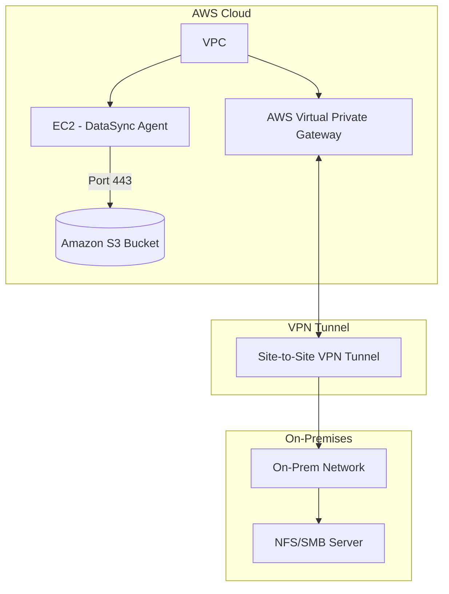

# Project Docker Containers and Monitoring - Internship Report

## 1. Introduction

### 1.1. Project Overview
<!-- Brief description of the project, objectives and importance -->
Docker Containers and Monitoring project is implemented to gain basic knowledge of Container monitoring and logging. This is part of DevOps internship program, focusing on deploying containerized web application (app-glitchbox) on Linux VM with monitoring and alerting.

### 1.2. Scope of Work
- **Timeline:** week 01 
- **Environment:** Production
- **Main Technologies:** Docker, Prometheus, Grafana, Alertmanager

### 1.3. Team Members
- **Intern:** Tai Le
- **Mentor:** Khoi Nguyen
- **Reviewer:** Khoi Nguyen

## 2. Requirements

### 2.1. Requirements Description

#### Primary Requirements:
<!-- Detailed description of the problem to be solved -->
- "Create git repository"
- "Create a Google Cloud account that includes a sub-account (IAM) with full permissions for Mentor"
- "Automatically deploy Glitch Box App, monitoring and alerting (grafana) to containers"
- "Automatically send alert to Discord"
  
### 2.2. Technical Requirements

#### Environment:
- **OS:** Ubuntu 22.04
- **Cloud Provider:** GCP
- **Containerization:** Docker
- **Monitoring:** Prometheus, Grafana, Alertmanager

## 3. Solution Architecture

### 3.1. Solution Overview
The system uses Prometheus, Alertmanager and Grafana to ensure Monitoring, Alerting and Visualization.

#### Architecture Diagram:
<!-- Use Mermaid diagrams for better visualization -->


*Priority: Use Mermaid diagrams

### 3.2. Main Components

#### CI/CD Tools:
- **CI Tool:** [GitHub Actions, GitLab CI, Jenkins]
  - Role: [Describe role]
  - Configuration: [Configuration file]

#### Deployment Mechanism:
- **CD Tool:** [ArgoCD, Helm, kubectl]
  - Role: [Describe role]
  - Strategy: [Blue-Green, Rolling Update]

#### Infrastructure:
- **IaC Tool:** [Terraform, Ansible]
  - Role: [Provisioning infrastructure]
  - Modules: [List of modules]

#### Monitoring & Alerting:
- **Monitoring:** [Prometheus, Grafana, DataDog]
- **Logging:** [ELK Stack, Loki, CloudWatch]
- **Alerting:** [AlertManager, PagerDuty, Slack]

### 3.3. Execution Workflow

#### Automated Workflow:
1. **Trigger:** [Git push, Pull Request, Schedule]
2. **Build Phase:**
   - Code checkout
   - Dependency installation
   - Unit tests execution
   - Code quality checks
3. **Test Phase:**
   - Integration tests
   - Security scanning
   - Performance tests
4. **Build Image:**
   - Docker image build
   - Image vulnerability scan
   - Tag and version
5. **Push Image:**
   - Push to container registry
   - Update manifest files
6. **Deploy:**
   - Deploy to target environment
   - Health checks
   - Smoke tests
7. **Notification:**
   - Success/failure notification
   - Metrics collection

## 4. Implementation Guide

### 4.1. Related Files/Scripts

#### Repository Structure:
```
project-root/
├── .github/workflows/           # GitHub Actions workflows
│   ├── ci.yml
│   └── cd.yml
├── compomnet-name-01/                      # Docker configurations
│   ├── Dockerfile
│   └── docker-compose.yml
|   |── Configuration.yml
|   |__ .env
├── terraform/                   # Infrastructure as Code
│   ├── main.tf
│   └── variables.tf
├── scripts/                     # Automation scripts
│   ├── deploy.sh
│   └── rollback.sh
```

#### Key Files:
- **Dockerfile:** [Docker image configuration description]
- **CI/CD Pipeline:** [.github/workflows/, .gitlab-ci.yml, Jenkinsfile]
- **Infrastructure:** [main.tf, ansible-playbook.yml]
- **Deployment:** [deployment.yaml, helm charts]

### 4.2. Initial Setup

#### Prerequisites:
```bash
# Install required tools
sudo apt update && sudo apt install -y docker.io git curl
```

#### Configuration Steps:
1. **Clone repository:**
   ```bash
   git clone [repository-url]
   cd [project-directory]
   ```

2. **Configure credentials:**
   ```bash
   # Setup Docker Hub credentials
   docker login
   
   # Setup cloud provider credentials
   export AWS_ACCESS_KEY_ID="your-key"
   export AWS_SECRET_ACCESS_KEY="your-secret"
   ```

3. **Initialize infrastructure:**
   ```bash
   cd terraform/
   terraform init
   terraform plan
   terraform apply
   ```

### 4.3. Configuration Variables

#### Environment Variables:
| Variable | Description | Example | Required |
|----------|-------------|---------|----------|
| `DOCKER_REGISTRY` | Container registry URL | `docker.io/username` | Yes |
| `KUBECONFIG` | Kubernetes config path | `~/.kube/config` | Yes |
| `SLACK_WEBHOOK_URL` | Slack notification URL | `https://hooks.slack.com/...` | No |
| `ENVIRONMENT` | Deployment environment | `staging/production` | Yes |

#### Secrets Management:
- **GitHub Secrets:** [List of secrets to create]
- **Kubernetes Secrets:** [ConfigMaps and Secrets]
- **Cloud Provider Secrets:** [IAM roles, service accounts]

#### Metrics Dashboard:
[Link to Grafana dashboard or screenshot]

## 5. Appendix

### 5.1. Tools Used
| Tool | Version | Purpose | Documentation |
|------|---------|---------|---------------|
| Docker | 24.0+ | Containerization | [docs.docker.com](https://docs.docker.com) |
| Kubernetes | 1.28+ | Orchestration | [kubernetes.io](https://kubernetes.io) |
| GitHub Actions | - | CI/CD | [docs.github.com](https://docs.github.com/actions) |
| Terraform | 1.5+ | Infrastructure | [terraform.io](https://terraform.io) |

### 5.2. References
- [Official Documentation Links]
- [Best Practices Guides]
- [Architecture References]
- [Security Guidelines]
