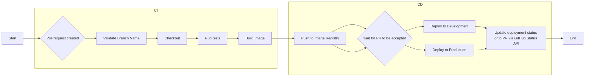

# Project CI/CD with Jenkins - Internship Report

## 1. Introduction

### 1.1. Project Overview
<!-- Brief description of the project, objectives and importance -->
Project CI/CD with Jenkins is implemented to achieve an understanding of CI/CD concepts and practices, proficiency in creating Jenkins pipelines, and a solid grasp of deployment strategies. This is part of the DevOps internship program, focusing on Jenkins Setup, Build and Test, and Pipeline Optimization.

### 1.2. Scope of Work
- **Timeline:** week 3 - week 4
- **Environment:** Development/Production
- **Main Technologies:** Docker, Jenkins

### 1.3. Team Members
- **Intern:** Tai Le
- **Mentor:** Khoi Nguyen
- **Reviewer:** Khoi Nguyen

## 2. Requirements

### 2.1. Requirements Description

#### Primary Requirements:
- Make CI pipeline work
- Testing automatically
- Build artifacts
- Implement Continuous Deployment across multiple environment

### 2.2. Technical Requirements

#### Environment:
- **OS:** Ubuntu 24.04
- **Cloud Provider:** GCP 
- **CI/CD Tool:** Jenkins
- **Containerization:** Docker

#### Security:
- Secret management

#### Logging & Monitoring:
- Ability to read jenkins pipeline logs and troubleshoot

#### Reliability:
- **Rollback strategy:** Blue-Green

## 3. Solution Architecture

### 3.1. Solution Overview
The system uses Jenkins's agents to ensure: build, test, and deployment tasks

#### Architecture Diagram:
<!-- Use Mermaid diagrams for better visualization -->

### 3.2. Main Components

- **CI/CD Tool:** Jenkins
  - Role: Validate Naming Convention; Checkout code; Build, Test, Push image to Docker Hub; Deploy to Dev or Prod enviroment; Update Github status for PR
  - Configuration: ./Jenkinsfile
  - Strategy: Trigger on Pull Request, Multiple Container Agents

- **Infrastructure:** Google Cloud Platform
  - VM's Role: Jenkins server; VM for Development Enviroments; VM for Production Enviroment  

### 3.3. Execution Pipeline

#### Automated Pipeline:
1. **Trigger:** Git push, Pull Request
2. **Validate Stage:**
   -  Validate Branch Name Convention
4. **Checkout Stage:**
   - Code checkout
6. **Build Stage:**
   - Sets up a build environment
   - Copy project file and restore as distinct layers
   - Copy source code and publish app
   - Runtime
   - Build Docker image
   - Tag and version
7. **Test Stage:**
   - Copy the entire solution into the container
   - Move to the main project directory 
   - Restore using the correct architecture
   - Build project
   - Test project
   - Build Docker image (specifically for testing)
9. **Push Image:**
   - Push to container registry (Docker Hub)
10. **Deploy:**
   - Pull latest Docker image
   - Deploy to target environment (Dev, Prod)
11. **Post Actions:**
   - Success/failure notification (via Github PR)

## 4. Implementation Guide

### 4.1. Related Files/Scripts

#### Repository Structure:
```
project-root/
├── .github/                     # PR template
│   └── pull_request_template.md
├── aspnetapp.test/              # app test
│   ├── bin/Debug/net9.0/
│   └── obj/
|   |── UnitTest1.cs
|   |__ aspnetapp.test.csproj
├── aspnetapp                   # app
│   ├── Pages/
│   └── Properties/
|   |── wwwroot/
|   |__ EnvironmentInfo.cs
│   ├── Program.cs
│   └── aspnetapp.csproj
|   |__ aspnetapp.sln
├── Dockerfile
├── Dockerfile.test
├── Jenkinsfile
└─ README.md
```

#### Key Files:
- **Dockerfile:** Sets up a build environment for a .NET 9.0 application.
- **Jenkinsfile:** Automates building, testing, and deploying the application to development and production environments.

### 4.2. Setup

#### Prerequisites (On the Jenkins server):
1. **Install Docker:**
```bash
# Add Docker's official GPG key:
sudo apt-get update
sudo apt-get install ca-certificates curl
sudo install -m 0755 -d /etc/apt/keyrings
sudo curl -fsSL https://download.docker.com/linux/ubuntu/gpg -o /etc/apt/keyrings/docker.asc
sudo chmod a+r /etc/apt/keyrings/docker.asc

# Add the repository to Apt sources:
echo \
  "deb [arch=$(dpkg --print-architecture) signed-by=/etc/apt/keyrings/docker.asc] https://download.docker.com/linux/ubuntu \
  $(. /etc/os-release && echo "${UBUNTU_CODENAME:-$VERSION_CODENAME}") stable" | \
  sudo tee /etc/apt/sources.list.d/docker.list > /dev/null
sudo apt-get update

sudo apt-get install docker-ce docker-ce-cli containerd.io docker-buildx-plugin docker-compose-plugin

sudo docker run hello-world

#Manage Docker as a Non-root User (Optional): If you want to run Docker commands without using sudo, add your user to the docker group:
sudo groupadd docker
sudo usermod -aG docker ${USER}
newgrp docker
```

2. **Install Jenkins:**
```bash
# Update package lists
sudo apt update

# Install OpenJDK 17 JRE Headless
sudo apt install fontconfig openjdk-21-jre -y
java -version

# Download Jenkins GPG key
sudo wget -O /etc/apt/keyrings/jenkins-keyring.asc \
  https://pkg.jenkins.io/debian-stable/jenkins.io-2023.key

# Add Jenkins repository
echo "deb [signed-by=/etc/apt/keyrings/jenkins-keyring.asc]" \
  https://pkg.jenkins.io/debian-stable binary/ | sudo tee \
  /etc/apt/sources.list.d/jenkins.list > /dev/null

# Update package lists again after adding new repository
sudo apt-get update

# Install Jenkins
sudo apt-get install jenkins -y
```

3. **Start Jenkins Container Agents:**

- Dockerfile
```bash
# Sử dụng Ubuntu làm hệ điều hành cơ sở
FROM ubuntu:22.04

# Thiết lập biến môi trường để không hỏi trong quá trình cài đặt
ENV DEBIAN_FRONTEND=noninteractive

# Cập nhật hệ thống và cài đặt các công cụ cần thiết
RUN apt-get update && apt-get install -y \
    openjdk-21-jdk \
    openssh-server \
    git \
    curl \
    wget \
    make \
    apt-transport-https \
    software-properties-common

# Cài đặt .NET SDK 9.0
RUN wget https://packages.microsoft.com/config/ubuntu/22.04/packages-microsoft-prod.deb -O packages-microsoft-prod.deb && \
    dpkg -i packages-microsoft-prod.deb && \
    rm packages-microsoft-prod.deb && \
    apt-get update && apt-get install -y dotnet-sdk-9.0

# Tạo thư mục SSH và cấu hình SSH server
RUN mkdir /var/run/sshd && \
    sed -i 's/#PermitRootLogin prohibit-password/PermitRootLogin yes/' /etc/ssh/sshd_config && \
    echo "PasswordAuthentication no" >> /etc/ssh/sshd_config

# Tạo user TaiKhau
RUN useradd -rm -d /home/TaiKhau -s /bin/bash TaiKhau && \
    mkdir /home/TaiKhau/.ssh && \
    chown TaiKhau:TaiKhau /home/TaiKhau/.ssh && \
    chmod 700 /home/TaiKhau/.ssh

# Thiết lập biến môi trường để chứa SSH public key
ENV JENKINS_AGENT_SSH_PUBKEY=""

# Copy script entrypoint vào container
COPY entrypoint.sh /entrypoint.sh
RUN chmod +x /entrypoint.sh

# Expose port SSH
EXPOSE 22

# Xóa các file không cần thiết để tối ưu kích thước image
RUN apt-get clean && rm -rf /var/lib/apt/lists/*

# Entrypoint script để khởi động container
ENTRYPOINT ["/entrypoint.sh"]
```
- entrypoint.sh
```bash
# Thêm SSH public key vào authorized_keys
echo "${JENKINS_AGENT_SSH_PUBKEY}" > /home/TaiKhau/.ssh/authorized_keys
chown TaiKhau:TaiKhau /home/TaiKhau/.ssh/authorized_keys
chmod 600 /home/TaiKhau/.ssh/authorized_keys

# Khởi động SSH service
/usr/sbin/sshd -D
```
- ssh_deploy.sh
```bash
# Build Docker image
docker build -t my-jenkins-agent .

# Run container
docker run -d --rm --name=agent-builder -p 4446:22 \
-e "[Put your SSH public key here!]" \
my-jenkins-agent
```

#### Pipeline Stages in Jenkinsfile:
1. **Validate Branch Name Convention** \
  When: Only runs for pull requests \
  Purpose: Enforces branch naming conventions \
  Rules:
    - Must start with: feature/, bugfix/, hotfix/, or refactor/
    - Can include optional issue reference: issue-123-
    - Must use lowercase letters, numbers, and hyphens
    - Cannot have consecutive hyphens or end with hyphen
    - Branches main and dev are exempt from the pattern
2. **Checkout** \
  Agent: agent-builder \
  Purpose: Checks out the code and sets up environment variables \
  Actions:
    - Determines if the build is for a pull request
    - Sets CURRENT_BRANCH based on build type
    - Records the Git commit SHA
    - For pull requests: updates GitHub status to "pending"
3. **Build** \
  Agent: agent-builder \
  Purpose: Builds the Docker image \
  Actions:
    - Builds the image with the build number as tag
4. **Test** \
  Agent: agent-builder \
  Purpose: Runs tests in a Docker container \
  Actions:
    - Builds a test image using Dockerfile.test
    - Verifies the test image exists
5. **Push to Docker Hub** \
  Agent: agent-builder \
  Purpose: Pushes the built image to Docker Hub \
  Actions:
    - Logs in to Docker Hub using credentials
    - Pushes the tagged image
6. **Deploy to Dev** \
  Agent: agent1 \
  When: Branch is dev or PR target is dev \
  Purpose: Deploys to development environment \
  Actions:
    - Connects to development VM via SSH
    - Pulls latest Docker image
    - Stops and removes existing container
    - Runs new container
7. **Deploy to Prod** \
  Agent: agent2 \
  When: Branch is main or PR target is main \
  Purpose: Deploys to production environment \
  Actions:
    - Requires manual approval
    - Connects to production VM via SSH
    - Pulls latest Docker image
    - Stops and removes existing container
    - Runs new container
 8. **Post-Build Actions** \
    Success:
    - Updates GitHub status to "success" for pull requests
    - Links to Jenkins build URL
    <!-- -->
    Failure:
    - Updates GitHub status to "failure" for pull requests
    - Links to Jenkins build URL
    
### 4.3. Environment Variables

#### Environment Variables:
| Variable | Description | 
|----------|-------------|
| `SSH_USER` | Username for SSH access to deployment servers | 
| `DEPLOY_DIR` | Directory on target servers where the application is deployed | 
| `DEPLOY_PORT` | Port on target enviroments where the application can be accessed |
| `GCP_VM_DEV` | IP address of development GCP virtual machine | 
| `GCP_VM_PROD` | IP address of production GCP virtual machine | 
| `DOCKER_HUB_CREDS` | Jenkins credentials for Docker Hub access | 
| `DOCKER_HUB_USERNAME` | Username for Docker Hub | 
| `IMAGE_NAME` | Name of the Docker image (username/aspnetapp) | 
| `GITHUB_TOKEN` | GitHub access token for API access | 
| `REPO_OWNER` | GitHub repository owner | 
| `REPO_NAME` | GitHub repository name | 

#### Jenkins credentials:
- **dockerhub-credentials:** Docker Hub credentials
- **ssh-private-key-file:** SSH key for server access
- **github-token:** GitHub access token

#### Jenkins agents:
- **agent-builder:** For build and test operations
- **agent1:** For dev deployments
- **agent2:** For production deployments

## 5. Appendix

### 5.1. Tools Used
| Tool | Version | Purpose | Documentation |
|------|---------|---------|---------------|
| Docker | 28.2.2 | Containerization | [docs.docker.com](https://docs.docker.com) |
| Jenkins | 2.504.2 | CI/CD | [jenkins.io](https://www.jenkins.io/doc/) |

### 5.2. References
- https://www.jenkins.io/doc/book/using/using-agents/
- https://github.com/jenkins-docs/quickstart-tutorials/blob/main/dockerfiles/dotnet/Dockerfile
- https://www.godaddy.com/resources/news/cicd-best-practices
- https://medium.com/@priorww/devops-world-2018-day-1-pipeline-basics-66e874fdd48a
