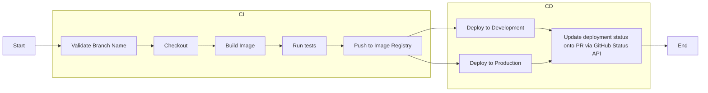

# Project CI/CD with Jenkins - Internship Report

## 1. Introduction

### 1.1. Project Overview
<!-- Brief description of the project, objectives and importance -->
Project CI/CD with Jenkins is implemented to achieve an understanding of CI/CD concepts and practices, proficiency in creating Jenkins pipelines, and a solid grasp of deployment strategies. This is part of the DevOps internship program, focusing on Jenkins Setup, Build and Test, and Pipeline Optimization.

### 1.2. Scope of Work
- **Timeline:** week 2 - week 3
- **Environment:** Development/Staging
- **Main Technologies:** Docker, Jenkins

### 1.3. Team Members
- **Intern:** Tai Le
- **Mentor:** Khoi Nguyen
- **Reviewer:** Khoi Nguyen

## 2. Requirements

### 2.1. Requirements Description

#### Primary Requirements:
- Make CI pipeline work
- Testing automatically
- Build artifacts
- Implement Continuous Deployment across multiple environment

### 2.2. Technical Requirements

#### Environment:
- **OS:** Ubuntu 24.04
- **Cloud Provider:** GCP 
- **CI/CD Tool:** Jenkins
- **Containerization:** Docker

#### Security:
- Secret management

#### Logging & Monitoring:
- Ability to read jenkins pipeline logs and troubleshoot

#### Reliability:
- **Rollback strategy:** Blue-Green

## 3. Solution Architecture

### 3.1. Solution Overview
The system uses Jenkins's agents to ensure: build, test, and deployment tasks

#### Architecture Diagram:
<!-- Use Mermaid diagrams for better visualization -->

### 3.2. Main Components

- **CI/CD Tool:** Jenkins
  - Role: Validate Naming Convention
  - Configuration: ./Jenkinsfile
  - Strategy: Trigger on Pull Request, Multiple Container Agents

- **Infrastructure:** Google Cloud Platform
  - VM's Role: Jenkins server, VM for Development Enviroments, VM for Production Enviroment  

### 3.3. Execution Pipeline

#### Automated Pipeline:
1. **Trigger:** Git push, Pull Request
2. **Validate Stage:**
   -  Validate Branch Name Convention
4. **Checkout Stage:**
   - Code checkout
6. **Build Stage:**
   - Sets up a build environment
   - Copy project file and restore as distinct layers
   - Copy source code and publish app
   - Runtime
   - Build Docker image
   - Tag and version
7. **Test Stage:**
   - Copy the entire solution into the container
   - Move to the main project directory 
   - Restore using the correct architecture
   - Build project
   - Test project
   - Build Docker image (specifically for testing)
9. **Push Image:**
   - Push to container registry (Docker Hub)
10. **Deploy:**
   - Pull latest Docker image
   - Deploy to target environment (Dev, Prod)
11. **Post Actions:**
   - Success/failure notification (via Github PR)

## 4. Implementation Guide

### 4.1. Related Files/Scripts

#### Repository Structure:
```
project-root/
├── .github/workflows/           # PR template
│   └── pull_request_template.md
├── aspnetapp.test/              # app test
│   ├── bin/Debug/net9.0/
│   └── obj/
|   |── UnitTest1.cs
|   |__ aspnetapp.test.csproj
├── aspnetapp                   # app
│   ├── Pages/
│   └── Properties/
|   |── wwwroot/
|   |__ EnvironmentInfo.cs
│   ├── Program.cs
│   └── aspnetapp.csproj
|   |__ aspnetapp.sln
├── Dockerfile
├── Dockerfile.test
├── Jenkinsfile
└─ README.md
```

#### Key Files:
- **Dockerfile:** [Docker image configuration description]
- **CI/CD Pipeline:** [.github/workflows/, .gitlab-ci.yml, Jenkinsfile]
- **Infrastructure:** [main.tf, ansible-playbook.yml]
- **Deployment:** [deployment.yaml, helm charts]

### 4.2. Initial Setup

#### Prerequisites:
```bash
# Install required tools
sudo apt update && sudo apt install -y docker.io git curl
```

#### Configuration Steps:
1. **Clone repository:**
   ```bash
   git clone [repository-url]
   cd [project-directory]
   ```

2. **Configure credentials:**
   ```bash
   # Setup Docker Hub credentials
   docker login
   
   # Setup cloud provider credentials
   export AWS_ACCESS_KEY_ID="your-key"
   export AWS_SECRET_ACCESS_KEY="your-secret"
   ```

3. **Initialize infrastructure:**
   ```bash
   cd terraform/
   terraform init
   terraform plan
   terraform apply
   ```

### 4.3. Configuration Variables

#### Environment Variables:
| Variable | Description | Example | Required |
|----------|-------------|---------|----------|
| `DOCKER_REGISTRY` | Container registry URL | `docker.io/username` | Yes |
| `KUBECONFIG` | Kubernetes config path | `~/.kube/config` | Yes |
| `SLACK_WEBHOOK_URL` | Slack notification URL | `https://hooks.slack.com/...` | No |
| `ENVIRONMENT` | Deployment environment | `staging/production` | Yes |

#### Secrets Management:
- **GitHub Secrets:** [List of secrets to create]
- **Kubernetes Secrets:** [ConfigMaps and Secrets]
- **Cloud Provider Secrets:** [IAM roles, service accounts]

#### Metrics Dashboard:
[Link to Grafana dashboard or screenshot]

## 5. Appendix

### 5.1. Tools Used
| Tool | Version | Purpose | Documentation |
|------|---------|---------|---------------|
| Docker | 24.0+ | Containerization | [docs.docker.com](https://docs.docker.com) |
| Kubernetes | 1.28+ | Orchestration | [kubernetes.io](https://kubernetes.io) |
| GitHub Actions | - | CI/CD | [docs.github.com](https://docs.github.com/actions) |
| Terraform | 1.5+ | Infrastructure | [terraform.io](https://terraform.io) |

### 5.2. References
- [Official Documentation Links]
- [Best Practices Guides]
- [Architecture References]
- [Security Guidelines]
