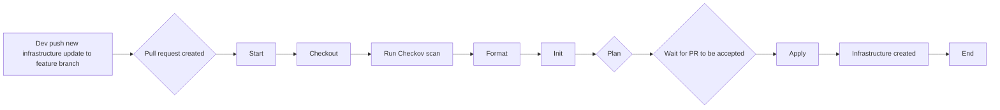

# Project Infrastructure as Code with Terraform - Internship Report

## 1. Introduction

### 1.1. Project Overview
<!-- Brief description of the project, objectives and importance -->
Project Infrastructure as Code with Terraform is implemented to achieve knowledge about Infrastructure as Code (IaC) using Terraform, a powerful tool for building, changing, and versioning infrastructure safely and efficiently. This is part of the DevOps internship program, focusing on: 
- understand Infrastructure as Code concepts
- Master Terraform basics and advanced features
- Learn module development and reuse
- Implement infrastructure best practices

### 1.2. Scope of Work
- **Timeline:** week 5 - week 6
- **Environment:** Development/Production
- **Main Technologies:** Terraform, Github Actions, Azure

### 1.3. Team Members
- **Intern:** Tai Le
- **Mentor:** Khoi Nguyen
- **Reviewer:** Khoi Nguyen

## 2. Requirements

### 2.1. Requirements Description

#### Primary Requirements:
<!-- Detailed description of the problem to be solved -->
- "Manages multiple environments"
- "Implements reusable modules"
- "Sets up VPC, networking, security groups, compute resources"
- "Create a CI/CD pipeline to validates Terraform code"
- "Implements plan/apply workflow"

### 2.2. Technical Requirements

#### Environment:
- **Cloud Provider:** Azure
- **CI/CD Tool:** GitHub Actions 
- **Infrastructure as Code:** Terraform

## 3. Solution Architecture

### 3.1. Solution Overview
#### Architecture Diagram:


### 3.2. Main Components

#### CI/CD Tools:
- **CI Tool:** GitHub Actions
  - Role: validates Terraform code using Checkov. Implement plan for dev enviroment, prod enviroment, base modules and apply dev, prod enviroments
  - Configuration: terraform-dev.yml, terraform-prod.yml, terraform.yml

#### Infrastructure:
- **IaC Tool:** Terraform
  - Role: Provisioning infrastructure with multiple enviroments management and reusable modules
  - Modules: network interface, public ip, resource group, security group, subnet, virtual machine, virtual network

### 3.3. Execution Workflow

#### Automated Workflow:
1. **Trigger:** Git push, Pull Request occur in the corresponding directories for enviroments (dev, prod)
2. **Checkout Repository:**
   - Retrieve the repository code
3. **Log into Azure:**
   - Sets up Terraform using the GitHub Action hashicorp/setup-terraform@v1
4. **Run Chekcov Scan:**
   - Runs a security scan on Terraform code using Checkov via Docker
5. **Terraform Format:**
   - Checks the formatting of Terraform code using the command 'terraform fmt -check'
6. **Terraform Init:**
   - Initializes Terraform in the working directory using the command 'terraform init'
7. **Terraform Plan:**
   - Generates a Terraform execution plan using the command 'terraform plan'
   - The -var flag passes the SSH_PUBLIC_KEY secret as a variable
   - Saves the generated plan to a file named tfplan
8. **Terraform Apply:**
   - Applies the Terraform execution plan using the command 'terraform apply -auto-approve tfplan'
   - This step only runs if: The triggering event is a push and The branch is main

## 4. Implementation Guide

### 4.1. Related Files/Scripts

#### Repository Structure:
```
terraform
├─ .github
│  ├─ workflows
│  │  ├─ terraform-dev.yml
│  │  ├─ terraform-prod.yml
│  └─ └─ terraform.yml
├─ environments
│  ├─ dev
│  │  ├─ main.tf
│  │  ├─ providers.tf
│  │  ├─ terraform.tfvars
│  │  └─ variables.tf
│  └─ prod
│     ├─ main.tf
│     ├─ providers.tf
│     ├─ terraform.tfvars
│     └─ variables.tf
└─ modules
   ├─ nic_module
   │  ├─ main.tf
   │  ├─ outputs.tf
   │  └─ variables.tf
   ├─ pubip_module
   │  ├─ main.tf
   │  ├─ outputs.tf
   │  └─ variables.tf
   ├─ rg_module
   │  ├─ main.tf
   │  ├─ outputs.tf
   │  └─ variables.tf
   ├─ sg_module
   │  ├─ main.tf
   │  ├─ outputs.tf
   │  └─ variables.tf
   ├─ subnet_module
   │  ├─ main.tf
   │  ├─ outputs.tf
   │  └─ variables.tf
   ├─ vm_module
   │  ├─ main.tf
   │  ├─ outputs.tf
   │  └─ variables.tf
   └─ vn_module
      ├─ main.tf
      ├─ outputs.tf
      └─ variables.tf
```

#### Key Files:
- **CI/CD Pipeline:** .github/workflows/terraform-dev.yml, .github/workflows/terraform-prod.yml
- **Infrastructure:** environments/dev/main.tf, environments/prod/main.tf

### 4.2. Initial Setup

#### Prerequisites:
- Download Terraform for Windows at https://developer.hashicorp.com/terraform/install#windows
- Add the terraform binary is available on your systems PATH

#### Configuration Steps:
1. **Configure credentials:**
   - Go to Azure Portal --> "Marketplace"
   - Search for "User Assigned Managed Identity", then click create
   - In create page, choose Resource group, Region, Name --> Review & Create
   - In the "Managed Identities" page, choose the Identity you just created --> "Settings" --> "Federated credentials" --> Add Credential
   - In the "Add Federated Credential" page, "Federated credential scenario", choose "Configure a Github issued token to impersonate this application and deploy to Azure"
   - Enter the "Organization" and "Repository" (your Github account name and your repo name)
   - In "Entity", choose "Branch", then enter the branch's name (main)
   - Finally, enter a name for your Credential
   - Return to the "Federated credentials" page, Add another Credential, but this time, in "Entity", choose "Pull Request"
   - In the same "Managed Identities" page, choose "Azure role assignments" --> Add role assignment
   - Select "Subscription" for Scope, choose your recent subscription's name and select "Contributor" for "Role"
   - Now you can get the Subscription ID, Application (client) ID from "App registrations", and Tenant ID from "Tenant Properties". Then store those ID into Github secrets.
  
2. **Create storage account for tfstate:**
   - Go to Azure Portal --> "Marketplace"
   - Search for "Storage Account", then click create
   - In "Create a storage account" page, choose your Subscriptiton and Resource group
   - Enter the "Storage account name" (much be unique), choose Region. In "Redundancy", choose "Zone-redundant storage (ZRS)
   - Then we just need to Review & Create.
   - Choose the "Storage Account" you just created, navigate to "Data storage", choose "Containers" --> Add a new container for tfstate
   - Now in the same page, choose Access Control (IAM) --> Add role assignment
   - In "Add role assignment", search for "Storage Blob Data Contributor"
   - Choose "Managed identity" for "Assign access to", then choose your "Subscription" and "Identity"
   - Finally, in the "providers.tf" file of your Terraform project, define the backend to use your Resource Group, Storage Account, Container, Key (use different key name for Dev and Prod enviroments so that the resources of these two enviroments wont be conflict when created)

3. **Understand the Terraform project structure:**
   - The project will have reusable modules. Each module will have "main.tf", "variables.tf" and "outputs.tf" files:
     + "main.tf" will be used to define the corresponding resource to be created;
     + "variables.tf" will be used to declare the input variables accepted by module;
     + "output.tf" will be used to export the output values of the created resource. These values can be used as variables for the arguments in other resources
   - There will be two enviroments in this project (dev and prod). In the folder of each enviroment, we will have "main.tf" file. In "main.tf", we will call the modules we need to used. In each module that we call, we need to enter suitable variables for that modules (we must use all the variables that were defined in module's "variables.tf file), and we can use the "depends_on" argument to ensure that these resources wont get conflict when being created
   - In "providers.tf":
     + required_providers: Defines the providers required for the project 
     + backend "azurerm": Configures to store Terraform state on Azure Storage (instead of locally) 
     + skip_provider_registration = false: Terraform will automatically register the required resource providers in Azure subscription
   - In "variables.tf" and "terraform.tfvars": Declare and define frequently used variables to support quick reuse

### 4.3. Configuration Variables

#### Environment Variables:
| Variable | Description | Example | Required |
|----------|-------------|---------|----------|
| `AZURE_CLIENT_ID` | Client ID | XXXXXXXX-XXXX-XXXX-XXXX-XXXXXXXXXXXX | Yes |
| `AZURE_SUBSCRIPTION_ID` | Subscription ID | XXXXXXXX-XXXX-XXXX-XXXX-XXXXXXXXXXXX | Yes |
| `AZURE_TENANT_ID` | Tenant ID | XXXXXXXX-XXXX-XXXX-XXXX-XXXXXXXXXXXX | Yes |
| `SSH_PUBLIC_KEY` | SSH Public key | XXXXXXXX-XXXX-XXXX-XXXX-XXXXXXXXXXXX | Yes |

## 5. Appendix

### 5.1. Tools Used
| Tool | Version | Purpose | Documentation |
|------|---------|---------|---------------|
| GitHub Actions | - | CI/CD | [docs.github.com](https://docs.github.com/actions) |
| Terraform | 1.12.2 | Infrastructure | [terraform.io](https://terraform.io) |

### 5.2. References
- https://registry.terraform.io/providers/hashicorp/azurerm/latest/docs
- https://medium.com/@almaswebconsulting/github-actions-an-in-depth-guide-for-beginners-514ed6f87a96
